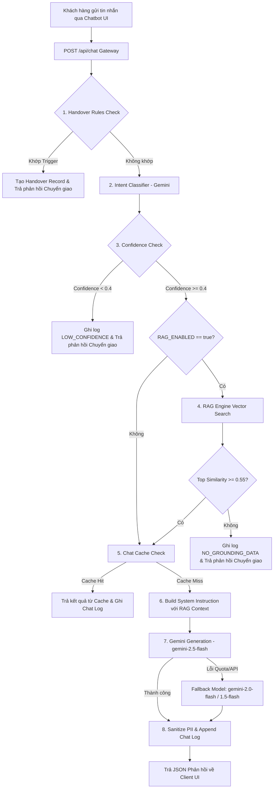

# Kiến Trúc Hệ Thống (Architecture Documentation)

Tài liệu này mô tả chi tiết sơ đồ luồng dữ liệu, các thành phần phần mềm và những quyết định kiến trúc chính của dự án **The Shine Fitness & Yoga Chatbot**.

---

## 1. Sơ đồ Luồng Xử lý Yêu cầu (/api/chat)

Sơ đồ dưới đây thể hiện luồng xử lý tuần tự một câu hỏi từ người dùng thông qua API Gateway đến khi trả về kết quả cuối cùng:

---

## 2. Bảng Mô Tả Chi Tiết Các Khối Chức Năng

| Khối chức năng | Input | Output | Lưu ý kỹ thuật |
| :--- | :--- | :--- | :--- |
| **API Gateway** | Request POST `{ message, history, lang, pronoun, isMember, sessionId }` | Response JSON `{ text, handover, handoverTag, hotline, sessionId }` | Định tuyến Express `/api/chat`, đo thời gian xử lý `latencyMs` từ đầu đến cuối. |
| **Handover Rules** | `message`, `history` | `HandoverTriggerResult` (`triggered`, `tag`, `reason`) | Kiểm tra 5 trigger từ khóa nhạy cảm (`SPECIALIST_CONSULT`, `FEEDBACK_COMPLAINT`, `MEMBERSHIP_CONTRACT`, `VIP_SCHEDULE`). Chạy TRƯỚC LLM để phản hồi tức thì. |
| **Intent Classifier** | `message`, `history` | `ClassificationResult` (`intent`, `pkSegment`, `slots`, `nextQuestion`, `confidence`) | Gọi Gemini với JSON Schema mode. Nhận diện phân khúc khách hàng (PK01-PK04) và câu gạn lọc Q1-Q4. |
| **RAG Engine** | `message`, `intent`, `topK` | `RetrievedChunk[]` (Danh sách các chunk kèm điểm `similarity`) | Tính Cosine Similarity giữa vector câu hỏi và 28 vectors trong `index.json`. Yêu cầu điểm số `>= 0.55`. |
| **Chat Cache** | `cacheKey` (Chuỗi mã hóa từ RAG IDs, ngữ cảnh, tin nhắn) | String response hoặc `null` | Cache bằng Map trong RAM. Giảm latency và tiết kiệm chi phí Gemini API cho các câu hỏi lặp lại. |
| **Gemini API** | System Instruction + History + Prompt câu hỏi | Phản hồi văn bản thô từ AI | Tự động chuyển đổi Fallback theo thứ tự: `gemini-2.5-flash` -> `gemini-2.0-flash` -> `gemini-1.5-flash`. |
| **Guardrails & PII** | Văn bản phản hồi thô | Văn bản đã làm sạch, ẩn PII | Hàm `sanitizePii()` thay thế SĐT thành `09** *** **89` và Email thành `d***g@gmail.com` trước khi lưu đĩa. |
| **Chat Log Storage** | Thông tin phiên, nội dung tin nhắn, latency, RAG metadata | Bản ghi CSV trong `data/chat_logs.csv` | Sử dụng khóa ghi file không đồng bộ (file lock) để tránh xung đột ghi đĩa. |
| **Analytics Dashboard** | File `chat_logs.csv` và `handover_queue.csv` | Báo cáo chỉ số KPI trực quan | Tính toán thời gian thực các chỉ số `Sourced Answer Rate`, `Average Top Similarity`, `Latency P95`. |

---

## 3. Các Quyết Định Kiến Trúc Chính (Key Architectural Decisions)

1. **Lưu trữ Log Đa Backend (CSV & Firestore)**:
   - *Lý do*: Mặc định hỗ trợ lưu trữ CSV đơn giản cho môi trường local/prototype, đồng thời hỗ trợ Firestore backend server-side (`STORAGE_BACKEND=firestore`) sử dụng `firebase-admin` với Firestore Transactions cho các bản ghi bàn giao, giúp duy trì dữ liệu bền vững qua các lần khởi động lại máy chủ.
   - *Bảo mật*: Các collection `chat_logs` và `handover_queue` được chặn hoàn toàn truy cập trực tiếp từ client trong `firestore.rules`.

2. **Tìm kiếm Vector bằng Cosine Similarity trong Bộ nhớ RAM (In-Memory)**:
   - *Lý do*: Tập dữ liệu tri thức phòng tập gồm 28 chunks (dưới 100KB), việc nạp toàn bộ vector vào RAM giúp thời gian truy vấn cực nhanh (< 5ms) mà không cần cài đặt các Vector Database phức tạp như Pinecone, Qdrant hay Pgvector.

3. **Xây dựng Chỉ mục Offline (Manual Offline Build Index) thay vì Build khi Khởi động**:
   - *Lý do*: Việc sinh vector embedding phụ thuộc vào Gemini Embedding API. Việc build offline bằng script `npm run build:index` giúp máy chủ web khởi động tức thì, không làm chậm container cold-start và chủ động kiểm soát thời điểm cập nhật tri thức.

4. **Kiểm tra Handover Rules TRƯỚC Cache và TRƯỚC LLM**:
   - *Lý do*: Đảm bảo các yêu cầu khẩn cấp hoặc khiếu nại của khách hàng luôn được phát hiện và chuyển giao cho tư vấn viên con người lập tức với độ trễ tối thiểu, tránh việc trả lời sai lệch hoặc sử dụng câu trả lời cũ từ cache.
