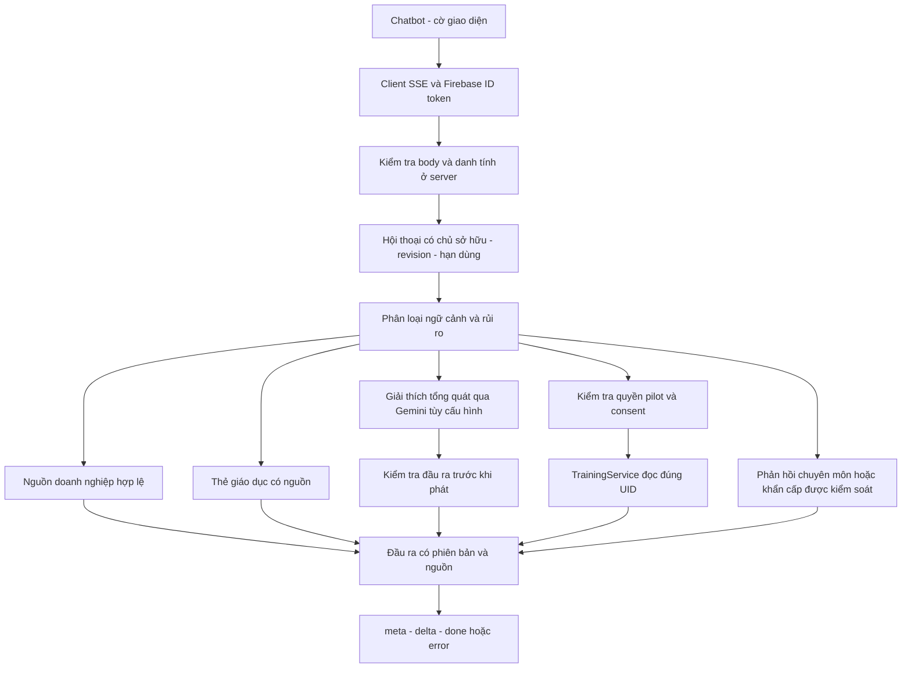

# AI Gym Buddy: giai đoạn 1 và 2

## 1. Phạm vi và baseline

Triển khai từ `feat/nutrition-knowledge` tại `d3269c43c64e13482e5c8ba423a36a4f62e9962f`, không từ main cũ và không gộp các nhánh song song. Nhánh làm việc: `feat/gym-buddy-unified-chat`. Không merge, deploy, nhập dữ liệu hội viên hoặc phê duyệt archive.

Đây là lõi hỏi đáp thống nhất cho khách và tài khoản đã đăng nhập, cộng khả năng đọc ngữ cảnh training được cấp quyền. Không phải bộ meal planner mới, fine-tuning hoặc chứng nhận an toàn y khoa. Các thay đổi được đặt sau cờ mặc định tắt.

## 2. Vấn đề đã xác minh trước khi sửa

Chat cũ lấy `memberInfo` từ body để xưng hô/hạng thẻ; không đọc training context bằng token trong luồng chat đó. Giao diện lưu lịch sử ở khóa trình duyệt chung, gửi lịch sử từ client, và trì hoãn hiển thị tối thiểu 600 ms. Prompt hướng CRM ép phản hồi ngắn, gạn lọc và upsell. Dinh dưỡng hoặc tên bệnh có thể bị chuyển giao dù chỉ hỏi khái niệm.

Luồng cũ có thể gọi classifier, embedding và generation nối tiếp, rồi mới cache. Các nguồn chương trình/dinh dưỡng hiện có là nguồn lịch sử chờ duyệt, không phải mẫu đã được cho phép đề xuất cá nhân.

Đã tái sử dụng Firebase Admin, TrainingService, quyền pilot, cấu trúc ngữ cảnh và metadata nguồn. Không tạo kho hồ sơ khách thứ hai. Hai file cũ được giữ nguyên từng byte ở `ChatbotLegacy.tsx` và `training/legacyRouter.ts`; kiểm thử khóa SHA để bảo vệ rollback.

## 3. Sơ đồ thực thi

Điểm gắn backend: `/api/companion/training/buddy`. Router mới tự xác thực trước router training cũ. Điều này cho phép khách hỏi kiến thức mà không bỏ bảo vệ các API training còn lại. Luồng mới không âm thầm rơi về `/api/chat` khi lỗi. `/api/chat` và UI cũ vẫn dành cho rollback; không khẳng định chúng đã được thay bằng chính sách mới nếu chưa bật cờ giao diện.

## 4. Danh tính và ma trận quyền

| Trạng thái | Kiến thức chung | Ngữ cảnh training riêng | Dữ liệu người khác | Metrics |
| --- | --- | --- | --- | --- |
| Khách | Có | Không | Không | Không |
| Firebase hợp lệ, chưa có quyền pilot | Có | Không | Không | Không |
| Email verified, quyền pilot, consent và cờ riêng bật | Có | Chỉ của mình | Không | Không |
| Admin đã xác minh | Có | Vẫn kiểm tra quyền của mình | Không tự có quyền đọc hồ sơ khác | Có |
| Token lỗi/thu hồi/hết hạn | Lỗi xác thực, không âm thầm hạ quyền | Không | Không | Không |

UID lấy từ `verifyIdToken(token, true)` do cấu hình server đang có cung cấp. `memberInfo`, `uid`, `role`, `history` trong body bị từ chối. Đăng nhập Firebase không chứng minh hợp đồng đã thanh toán; quyền pilot không được đổi thành quyền hội viên trả phí.

Quyền riêng cần đồng thời: cờ chat ngữ cảnh, cờ training, email xác minh, UID được cấp quyền, hồ sơ đúng UID và consent. Kiểm tra lại mỗi yêu cầu riêng, không dựa vào lần đăng nhập đầu. Profile và lịch sử không được gửi cho Gemini; phản hồi riêng được tạo từ các trường cần thiết bằng code.

## 5. Hội thoại và quyền riêng tư

Khách nhận một ID ngẫu nhiên và capability ngẫu nhiên; server chỉ giữ hash của capability. Biết ID mà không có capability không đọc được metadata hoặc gửi tiếp. Hội thoại tài khoản gắn UID và không tự nhận hội thoại khách khi đăng nhập. Không có endpoint tải toàn bộ transcript.

Bộ nhớ là RAM của một process, giới hạn 512 phiên, 20 phút không hoạt động và tối đa hai giờ, 120 lượt mỗi phiên; chỉ giữ tối đa 12 mẩu hội thoại và 12.000 ký tự. Nội dung yêu cầu riêng/an toàn không được giữ nguyên để gửi cho mô hình ở lượt sau; chỉ có tín hiệu thận trọng tạm và chủ đề. Tín hiệu này không phải chẩn đoán hay trường bệnh trong hồ sơ.

Không lưu transcript/capability vào localStorage. Đổi tài khoản, reset hoặc đóng panel hủy client đang chạy và tăng generation guard để chặn phản hồi đến muộn. Thông tin hiển thị có UID khác Firebase làm chat tạm dừng, không đọc dữ liệu trong trạng thái mâu thuẫn. Logout không xóa lịch sử training lâu dài.

Giới hạn vận hành: RAM không chia sẻ giữa instance. Pilot nên dùng một instance hoặc routing phù hợp; khi mất phiên, server trả lỗi và yêu cầu mở phiên mới, không tạo lại với dữ liệu giả. Muốn mở rộng nhiều instance cần thiết kế kho phiên riêng có TTL, mã hóa/phân quyền và đánh giá quyền riêng tư. Không dùng persistent transcript chỉ để che giới hạn này.

## 6. Chính sách câu hỏi

| Nhóm | Ví dụ | Cách xử lý |
| --- | --- | --- |
| Giáo dục dinh dưỡng | Protein là gì, TDEE khác BMR thế nào | Trả lời kiến thức, không bắt đăng nhập |
| Giáo dục sức khỏe | Tiểu đường type 2 là gì | Giải thích, không ghi người hỏi mắc bệnh |
| Giáo dục gym | Progressive overload, RIR | Trả lời đúng chủ đề, không ép upsell |
| Dịch vụ | Giá/giờ/địa chỉ | Chỉ nguồn doanh nghiệp đang hợp lệ |
| Dữ liệu riêng | Tôi đã tập gì tuần này | Kiểm tra UID/quyền/consent rồi đọc |
| Kế hoạch mới | Tôi có 35 phút muốn tập chân | Chuyển tới Training để xác nhận; không giả vờ chat đã tạo kế hoạch |
| Ghi nhận | Tôi đã ăn/tập xong | `saved:false`; mở quy trình xác nhận đã có nếu phù hợp |
| Cá nhân có nguy cơ | Bệnh lý, triệu chứng, liều thuốc, trẻ xin ăn kiêng | Không dựng chỉ định; đề nghị chuyên gia phù hợp |
| Có thể khẩn cấp | Dấu hiệu cảnh báo hiện tại | Nội dung kiểm soát, ưu tiên tìm trợ giúp, không hứa đã gọi thay |

Chính sách mới không sửa `programSafety.ts` hoặc `nutritionRouting.ts` để mở toàn bộ luồng cũ. Nó phân biệt khái niệm, tự khai, câu phủ định, trích dẫn, thời điểm và tín hiệu còn liên quan trong hội thoại mới. Các test cũ vẫn được chạy; test mới xác nhận thay đổi hợp đồng chỉ ở phiên bản mới. Bộ nhận diện bằng quy tắc có thể sai, chưa được thẩm định lâm sàng hoặc bao phủ mọi cách nói.

## 7. Nguồn và generation

`data/education/buddy-concepts.json` là lớp giáo dục mới gồm thẻ tiếng Việt/Anh, nguồn chính thức, ngày đối chiếu và hạn dùng. Không phải nội dung do PT/bác sĩ của The Shine đã duyệt. Nó không thay thế bản chép DOCX hoặc các nguồn lịch sử.

Nguồn doanh nghiệp được đọc cục bộ từ các file 01-06 hợp lệ, kiểm tra frontmatter/category/effective/expiry, không có embedding mạng. Không đủ nguồn thì nói rõ; không lấy giá hoặc máy từ kiến thức mô hình. Kết quả nguồn doanh nghiệp là trích nội dung nguyên bản nên câu hỏi tiếng Anh vẫn có thể nhận đoạn nguồn tiếng Việt có nhãn rõ.

Các câu giáo dục chưa có thẻ chính xác có thể dùng Gemini theo phạm vi đã định tuyến. Giải thích mô hình không có nguồn tương ứng được gắn lý do `general_model_knowledge_not_source_verified`; không tạo citation giả. Với giáo dục sức khỏe/dinh dưỡng, adapter giữ toàn bộ đầu ra để kiểm tra trước khi phát. Câu rủi ro cao không được chuyển sang generation.

Các guard đầu ra và system instruction là lớp giảm rủi ro, không phải bảo đảm rằng mọi câu mô hình đều đúng. Chưa có live web search trong runtime; không gửi hồ sơ ra công cụ tìm kiếm. Chưa mở archive, tạo embedding mới, thay `index.json`, đổi verified hoặc nhập JSON nguồn thành dữ liệu cá nhân.

## 8. Streaming, cache và độ trễ

Hợp đồng SSE có `meta`, `delta`, `done` và `error`; trường cuối giữ `text`, `sessionId`, `handover` cùng metadata phiên bản mới. Client kiểm tra UTF-8, kích thước frame, ID, nội dung cuối và trạng thái hoàn tất. Không có delay 600 ms trong UI mới; trạng thái chờ không được tính như nội dung hữu ích.

Tuyến thẻ nguồn/FAQ không gọi model. Không gọi classifier model riêng. Khi cần Gemini, mặc định một lời gọi; fallback cấu hình tùy chọn, tối đa một lần và chỉ trước khi nội dung đã được phát. Không nối nửa câu của hai model. Có deadline chung, abort khi ngắt kết nối và kiểm tra nội dung trước khi phát từng câu fitness hoặc toàn bộ câu trả lời sức khỏe/dinh dưỡng.

Cache chỉ cho thẻ công khai không phụ thuộc người, giới hạn 128 mục, TTL năm phút. Khóa gồm câu hỏi, ngôn ngữ, tác vụ, chủ đề, phiên bản nguồn và chính sách; đọc nguồn kiểm tra hiệu lực trước khi dùng cache. Không cache output cá nhân hoặc toàn bộ câu trả lời model chưa có nguồn.

Theo tài liệu SDK, AbortSignal chặn phía client nhưng không bảo đảm server của provider ngừng xử lý hay ngừng tính phí. Timeout không được quảng cáo thành cơ chế hoàn tiền hoặc hủy tính phí.

## 9. Metrics và thao tác dữ liệu

`GET /api/companion/training/buddy/metrics` chỉ cho admin: tối đa 500 mẫu gần đây trong process, đếm intent, cache/model và p50/p95 từng giai đoạn. Không có UID, token, email, transcript hoặc bệnh lý trong metrics. Đây là metrics riêng của luồng mới; dashboard CRM cũ chưa hiển thị chúng tự động.

`handoverStatus:suggested` nghĩa là đề nghị chuyển giao. Không có thao tác đặt lịch hoặc gửi hồ sơ từ module này. `saved:false` nói về dữ liệu nghiệp vụ hội viên; metadata phiên tạm vẫn thay đổi để duy trì hội thoại. Không giả báo meal/workout đã lưu.

## 10. Tham chiếu kỹ thuật

Đối chiếu ngày 23/09/2026:
- Firebase ID token: https://firebase.google.com/docs/auth/admin/verify-id-tokens
- Firebase Admin checkRevoked: https://firebase.google.com/docs/reference/admin/node/firebase-admin.auth.baseauth
- Gemini generateContentStream: https://googleapis.github.io/js-genai/release_docs/
- Gemini AbortSignal: https://googleapis.github.io/js-genai/release_docs/interfaces/types.GenerateContentConfig.html

Các nguồn giáo dục cụ thể nằm trong JSON thẻ. Nguồn cũ không được âm thầm sửa theo kiến thức ngoài.

## 11. Việc tiếp theo

Giai đoạn 3: nội dung tổng quan và thiết bị/bài/định lượng được xác minh, không đổi cờ archive để vượt duyệt. Giai đoạn 4: chương trình được gán và ghi chú PT có nguồn, revision, thời hạn và quyền rõ. Giai đoạn 5: meal plan được duyệt, thành phần/khẩu phần và nhật ký xác nhận. Giai đoạn 6: staging bằng tài khoản thật, provider thật, nhiều instance, điện thoại và đánh giá chuyên môn. Không gọi các interface hoặc bước này là tính năng đã triển khai.
