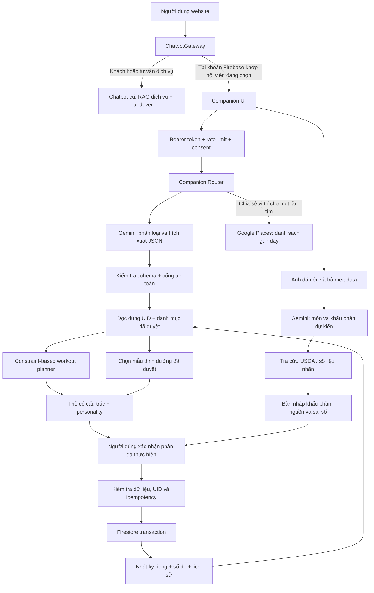

# Shine Companion — Kiến trúc AI cá nhân hóa theo hội viên

**Phạm vi:** MVP/pilot có kiểm soát, không phải sản phẩm đã được kiểm định lâm sàng hoặc triển khai production. Đọc kèm [hướng dẫn triển khai và kiểm thử](shine-companion-rollout.md). Các khả năng trong tài liệu phân biệt rõ phần đã có mã, phần cần dữ liệu thật và phần chưa triển khai.

## 1. Từ chatbot bán hàng đến một phần của trải nghiệm gym

Chatbot cũ tập trung bảng giá, ưu đãi, lịch lớp và chuyển tư vấn viên. Shine Companion thêm một luồng riêng cho người đăng nhập Firebase: hồ sơ, buổi tập theo thiết bị, nhật ký tập, nhật ký ăn và tương tác có phong cách thương hiệu. Khách vãng lai vẫn dùng bot dịch vụ; dữ liệu tập luyện không được đẩy vào prompt/cache/log bán hàng.

Ba trụ cột:

- **Hiểu người tập:** mục tiêu, kinh nghiệm, thời gian có thể tập, số đo tự báo, mức năng lượng, đau/ê mỏi, chế độ ăn và dữ liệu thực sự đã ghi nhận.
- **Hiểu gym:** chỉ chọn bài và chỉ dẫn từ danh mục máy, khu vực và hướng dẫn được quản lý/HLV xác minh. Không suy đoán gym có máy gì từ tên thương hiệu.
- **Có tính cách:** tích cực, rõ ràng, không phán xét cơ thể hoặc gây áp lực tập xuyên qua đau; có ba cách diễn đạt nhưng dùng cùng quy tắc an toàn.

Tên diễn đạt khi thuyết trình: **“Shine Companion — trợ lý tập luyện cá nhân hóa, hiểu thiết bị phòng tập và mang phong cách The Shine.”** Tính cá nhân hóa và tính cách là hai lớp khác nhau; đổi giọng văn không đủ để tạo cá nhân hóa.

## 2. Kiến trúc tổng thể



Không sử dụng mô hình để tự ghi database. Mô hình chỉ hiểu yêu cầu hoặc tạo ứng viên nhận diện; code máy chủ chọn chức năng, kiểm tra quyền, tính số liệu và thực hiện ghi sau xác nhận.

## 3. Kỹ thuật nào thực sự được sử dụng?

| Kỹ thuật | Cách dùng trong mã | Không nên tuyên bố |
| --- | --- | --- |
| Intent classification | Gemini phân loại workout, meal, nutrition, progress, nearby, log_workout, safety | Mô hình tự hiểu mọi tình huống chính xác tuyệt đối |
| Structured output / JSON Schema | Giới hạn kết quả trích xuất vào các trường, enum và dạng số xác định; kiểm tra lại khi nhận | JSON hợp lệ đồng nghĩa nội dung đúng |
| Tool orchestration ở máy chủ | Router dispatch đến planner, nutrition, diary, Places theo allowlist | Đã xây multi-agent tự trị hoặc vòng native function-calling đầy đủ |
| Structured personal memory | Hồ sơ và nhật ký đã xác nhận được lưu theo Firebase UID | Lưu vô hạn mọi câu chat hoặc huấn luyện riêng một mô hình cho từng người |
| Context-aware retrieval | Đọc lịch sử của đúng UID, tình trạng hiện tại, thiết bị đã xác minh | Đã có vector database mới cho toàn bộ hồ sơ hội viên |
| Constraint-based planning | Lọc thiết bị, nhóm cơ, trình độ, tình trạng và thời gian; chọn bài theo heuristic minh bạch | Thuật toán đã được chứng minh tối ưu hoặc chẩn đoán mức hồi phục cơ |
| Grounded gym guidance | Mỗi bài tham chiếu stationId và directions thật trong catalogue | AI tự nhìn thấy vị trí người dùng trong gym |
| Multimodal image understanding | Gemini nhận ảnh món ăn để tạo ứng viên món/khẩu phần | Ảnh đo chính xác gram, dầu, đường hoặc kcal |
| Deterministic nutrition arithmetic | Kcal = gram thực tế × kcal trên 100 g / 100 | Mô hình ngôn ngữ là máy tính hoặc số kcal đã được kiểm định |
| Human-in-the-loop | Xác nhận khẩu phần/nguồn và hiệp thực tế trước khi ghi | Đề xuất tự động đồng nghĩa hoàn tất tự động |
| Transaction + idempotency | Một planId chỉ có một log; một requestId bữa ăn chống gửi lại ghi trùng | Mạng không thể lỗi hoặc mọi thao tác liên hệ nhân sự đã được hoàn tất |
| Personality layer | Ba phong cách diễn đạt thống nhất giá trị thương hiệu | Đã fine-tune, reinforcement learning hoặc xây mô hình cảm xúc |

**RAG hiện có vẫn phục vụ bot dịch vụ.** Luồng Companion mới chủ yếu dùng truy xuất có cấu trúc và rule engine; không cần nhét số đo hoặc dữ liệu nhạy cảm vào chỉ mục RAG công khai. Các kỹ thuật có thể phát triển tiếp nhưng không được ghi thành đã triển khai.

## 4. Bản đồ mã nguồn

```text
src/components/companion/
  ChatbotGateway.tsx    Chọn bot dịch vụ hoặc companion, tách state theo UID
  CompanionChat.tsx    Điều phối giao diện, chat, readiness, nhật ký, admin
  ProfileForm.tsx      Hồ sơ, sàng lọc tự báo, consent và lựa chọn personality
  WorkoutCard.tsx      Bài tập, vị trí máy, hướng dẫn, đối chiếu và hiệp thực tế
  MealDraft.tsx        Sửa nhận diện, khẩu phần, tra nguồn và xác nhận đã ăn
  client.ts            Firebase token, timeout, kiểm tra đổi tài khoản, xử lý ảnh
server/src/companion/
  router.ts            API, phân quyền, dispatch, transaction và xuất/xóa dữ liệu
  core.mjs             Hàm nghiệp vụ thuần, không model/network/database
  providers.ts         Gemini, USDA FoodData Central và Google Places
scripts/integrate_companion.mjs
  Tích hợp có kiểm tra dấu mốc; chạy lại không nhân đôi thay đổi
 tests/companion.test.mjs
  Unit tests độc lập dependency và dữ liệu thật
 data/companion/catalogue.template.json
  Mẫu chưa xác minh, không tự động nạp vào production
```

## 5. Hồ sơ, trí nhớ và quyền truy cập

```text
companion_members/{firebaseUid}
  state: active | deleting
  profile:
    revision, consentVersion, nickname, age, heightCm, weightKg
    goal, experience, preferredMinutes, timezone
    style, diet, allergies, needsProfessionalReview, photoConsent
  /measurements/{revision}  Số đo tự báo khi thay đổi
  /plans/{planId}           Giáo án dự kiến, không phải nhật ký hoàn thành
  /workouts/{planId}        Phần tập thực tế đã xác nhận
  /meals/{requestHash}      Món, gram, nguồn, kcal ước lượng, thời điểm
  /handover/{id}            Yêu cầu đã ghi, không đồng nghĩa nhân sự đã nhận
companion_catalogues/the-shine
  revision, verified, equipment[], exercises[], nutritionTemplates[]
```

Danh tính chỉ lấy từ Firebase ID token đã kiểm tra. Body không quyết định UID. Đăng nhập OTP mô phỏng phía trình duyệt không đủ mở Companion. **Xác thực tài khoản không đồng nghĩa xác minh hội viên đã thanh toán**; entitlement thương mại cần kiểm tra riêng ở production.

Hồ sơ có revision. Các transaction ghi kiểm tra revision hiện tại để không ghi giáo án dựa trên hồ sơ cũ sau khi người dùng thay đổi hoặc xóa dữ liệu. Khi xóa, trạng thái `deleting` chặn ghi mới; xóa collection con trước khi xóa root. Dữ liệu hội viên/legacy nằm ngoài phạm vi xóa Companion và phải thông báo rõ.

Các collection Companion không cho client Firestore truy cập trực tiếp. Mọi thao tác đi qua API; admin catalogue kiểm tra email verified và ADMIN_EMAILS. Không dùng cache trả lời cá nhân dùng chung giữa các UID. Khi đổi tài khoản, UI remount để bỏ bản nháp và hội thoại cũ.

## 6. Flow 1 — “Hôm nay tôi nên tập gì?” / “35 phút, tập chân”

1. Xác thực và đọc hồ sơ; yêu cầu xác nhận readiness hiện tại. Không mặc định “không đau” là đã được người dùng xác nhận.
2. Mô hình trích xuất ý định, thời gian và nhóm cơ; người dùng cũng có thể bỏ qua mô hình bằng biểu mẫu tạo buổi tập.
3. Rule engine loại máy chưa xác minh, bảo trì, máy người dùng báo bận; loại bài vượt trình độ hoặc đụng nhóm cơ đang ê mỏi/gần đây đã tập.
4. Heuristic đếm số buổi theo nhóm cơ trong 7 ngày, ưu tiên nhóm ít được ghi nhận hơn. Loại nhóm cơ trong 48 giờ gần nhất là **quy tắc pilot bảo thủ**, không phải kết luận rằng cơ đã/chưa hồi phục.
5. Tính thời gian gồm khởi động 5 phút, thả lỏng 3 phút, hiệp, nghỉ và chuyển máy. Giảm số hiệp khi cần; không trả kế hoạch vượt số phút được cấp. Không cố kéo dài bằng bài thừa.
6. Trả bài gắn stationId, tên khu, directions, cues và số lần/tạ đã ghi trước đây để đối chiếu. Tạ trước đây không trở thành mức tạ bắt buộc hoặc tự tăng.
7. Người dùng nhập hiệp thực tế; trường chưa thực hiện để trống. Transaction lưu một log theo planId, đánh dấu completed hoặc partial. Kết quả này được truy xuất cho lần sau.

Chiều cao/cân nặng được lưu và theo dõi như dữ liệu cá nhân, **không quyết định tạ hoặc kỹ thuật chỉ từ số đo**. Phiên bản này chưa tự periodize giáo án nhiều tuần, chưa phát hiện tư thế qua camera và chưa tự đồng bộ wearable/máy tập. Số phút là ước lượng, không cam kết thời gian chính xác.

“Máy khả dụng” hiện gồm trạng thái quản lý và báo cáo của hội viên. Không có cảm biến occupancy; chỉ dẫn là từ mốc cố định đã duyệt, không phải định vị trong nhà theo thời gian thực.

## 7. Flow 2 — Ăn gì trước/sau tập, tìm quán và ghi bữa

Câu hỏi dinh dưỡng dùng mục tiêu, chế độ ăn, thời gian đến buổi tập và nhật ký đã ghi hôm nay. Các lựa chọn được lấy từ mẫu có người duyệt và nguồn, lọc theo mục tiêu/chế độ ăn/pre_soon/pre_later/post. Không có mẫu phù hợp thì báo thiếu dữ liệu, không sinh thực đơn có vẻ đáng tin nhưng chưa kiểm chứng.

Nhật ký gần nhất giúp hiển thị bối cảnh; **không tự suy ra người đó đói, đã ăn đủ hoặc bắt buộc ăn thêm**. Không tự lập chế độ điều trị, kê supplement hoặc tính thâm hụt kcal từ chiều cao/cân nặng. Trường hợp có dị ứng hoặc vấn đề sức khỏe cần chuyên gia xem xét.

Tìm quán là chức năng riêng: người dùng bấm chia sẻ vị trí; trình duyệt xin quyền; máy chủ gửi vị trí cho Google Places cho một lần tra cứu. Không lưu tọa độ. Kết quả gần đây không chứng minh quán có đúng món, số kcal hoặc độ an toàn dị ứng. Hiển thị thời điểm kiểm tra, nhà cung cấp, bản đồ và trạng thái mở cửa nếu nguồn có dữ liệu.

Sau khi ăn, người dùng gửi mô tả hoặc nhập từ nhãn. Món dự kiến chưa được ghi thành đã ăn. Khi họ xác nhận đúng món, gram và nguồn, máy chủ tính rồi lưu; tổng ngày tính theo múi giờ hồ sơ, không theo ngày UTC.

## 8. Flow 3 — Ảnh món ăn và kcal có nguồn

```text
Chọn/chụp ảnh → kiểm tra định dạng và dung lượng
→ redraw canvas, bỏ EXIF, giới hạn cạnh 1024 px, JPEG ≤1 MB
→ đồng ý gửi Gemini → ứng viên món + khoảng gram + câu hỏi bổ sung
→ chọn đúng dữ liệu USDA, phân biệt raw/cooked; hoặc số liệu nhãn/công thức
→ chỉnh khẩu phần thực sự đã ăn → xác nhận
→ server tải lại bản ghi nguồn → tính kcal → transaction → nhật ký ngày
```

Mô hình không trả con số kcal làm nguồn sự thật. Chỉ dùng Foundation/SR Legacy có năng lượng theo 100 g trong adapter hiện tại; thiếu nutrient thì báo thiếu, không gán 0. Nhãn/công thức do người dùng nhập được ghi là `member_label`, không gọi là số liệu đã được hệ thống kiểm chứng độc lập.

Ví dụ số học thuần: **150 g × 200 kcal/100 g = 300 kcal**. Đây không phải thông tin dinh dưỡng cho một món cụ thể. Nếu lượng ước tính 120–180 g, khoảng do khẩu phần là 240–360 kcal. Khoảng này chưa bao quát sai số dầu, công thức, cách nấu và dữ liệu nguồn.

Ảnh gốc không lưu trong ứng dụng; chính sách xử lý ở nhà cung cấp Gemini phải được đánh giá theo cấu hình/tài khoản thực tế. Không hứa zero retention nếu chưa có căn cứ. Ảnh không dùng để suy đoán bệnh, cơ thể hoặc danh tính người xuất hiện.

## 9. Personality của The Shine

Giá trị cốt lõi đề xuất cho pilot: **tích cực nhưng không ép, có mục tiêu nhưng không phán xét, nói điều có dữ liệu và thừa nhận điều chưa biết.** Khẩu hiệu được dùng tiết chế: “Shine on. Sweat on.”

- Gentle: “Mình chọn một buổi vừa sức nhé.”
- Energetic: “Mình tập có mục tiêu, không cần tập bằng mọi giá.”
- Direct: “Đây là phương án dựa trên thời gian, dữ liệu đã ghi và thiết bị đã xác minh.”

Cách diễn đạt không thay đổi mức an toàn hoặc quyền truy cập. Không tự nhận là bác sĩ/HLV thật; không chê cơ thể, gây mặc cảm vì nghỉ tập, ép ăn kiêng hoặc hứa kết quả. Personality v1 là template kiểm soát được, **chưa phải nhân vật hội thoại tự do đã fine-tune**. Đây là lựa chọn kỹ thuật để thẩm định dữ liệu và hành động trước khi mở rộng lời thoại.

## 10. API và trạng thái hành động

| API dưới /api/companion | Mục đích |
| --- | --- |
| GET /context; PUT /profile | Hồ sơ và ngữ cảnh đúng UID |
| POST /chat | Hiểu ý định và điều phối; không tự ghi hoàn thành |
| POST /workouts/plan | Tạo proposed plan với revision và hạn dùng |
| POST /workouts/:planId/complete | Xác nhận actual sets, chống ghi trùng theo planId |
| POST /nutrition/advice | Lựa chọn từ template đã duyệt |
| POST /food/analyze; GET /foods/search | Ảnh/text → bản nháp, tra món |
| POST /meals; DELETE /meals/:id | Ghi bữa xác nhận; bỏ bản ghi sai |
| GET /diary | Tổng các bữa đã ghi trong ngày địa phương |
| POST /places/nearby | Vị trí đồng ý cho một lần tra cứu |
| POST /handover | Ghi yêu cầu, chưa có cam kết lịch/nhân sự nhận |
| GET /export; DELETE /data | Xuất/xóa dữ liệu Companion |
| GET/PUT /admin/catalogue | Danh mục với quyền admin và kiểm tra revision |

Workout: proposed → completed/partial. Meal: draft ở UI → confirmed record ở server. Retry cùng payload và requestId không tạo thêm bữa. Retry khác payload với ID cũ báo conflict. Thất bại sau khi lưu nhưng trước khi tải lại UI không được báo thành “chưa lưu”.

## 11. Vận hành và giới hạn cần công bố

Cần kiểm tra toàn bộ ứng dụng trước production: token/owner authorization ở API legacy, Firestore emulator tests, abuse protection dùng chung nhiều instance, quota từng provider, chính sách consent/retention, bảo vệ dữ liệu riêng và các file dữ liệu đang nằm trong repository. Unit tests không chứng minh mọi tình huống bảo mật/triệu chứng đã được xử lý.

Handover endpoint hiện chỉ ghi yêu cầu riêng, chưa phát thông báo cho HLV, chưa tạo lịch hẹn. UI giữ lối về tư vấn dịch vụ để liên hệ con người. Chưa có đồng bộ hai chiều với mọi biểu đồ MemberPortal cũ; dữ liệu mới nằm trong cùng UID của Companion và có chức năng xuất.

Bài tập/định lượng mẫu phải được HLV hoặc chuyên gia phù hợp thẩm định. `verified` là dấu xác nhận của quản lý, không phải bằng chứng tự động của AI. Dữ liệu thật và trải nghiệm chạy staging là điều kiện mở pilot, không phải phụ lục tùy chọn.

## 12. Tài liệu kỹ thuật gốc

- Google Gemini: [Structured outputs](https://ai.google.dev/gemini-api/docs/structured-output) và [Image understanding](https://ai.google.dev/gemini-api/docs/image-understanding).
- Google Maps Platform: [Nearby Search (New)](https://developers.google.com/maps/documentation/places/web-service/nearby-search). Kiểm tra thêm yêu cầu attribution và điều khoản trước production.
- USDA: [FoodData Central API Guide](https://fdc.nal.usda.gov/api-guide).
- Firebase: [Verify ID tokens](https://firebase.google.com/docs/auth/admin/verify-id-tokens), [Firestore transactions](https://firebase.google.com/docs/firestore/manage-data/transactions).

**Câu kết để trình bày:** “Điểm khác biệt không phải AI trả lời dài hơn. Hệ thống kết hợp hiểu ngôn ngữ, dữ liệu hội viên đúng quyền, danh mục gym đã xác minh, thuật toán có ràng buộc và xác nhận hành động để tạo một trải nghiệm đồng hành có thể kiểm soát.”
