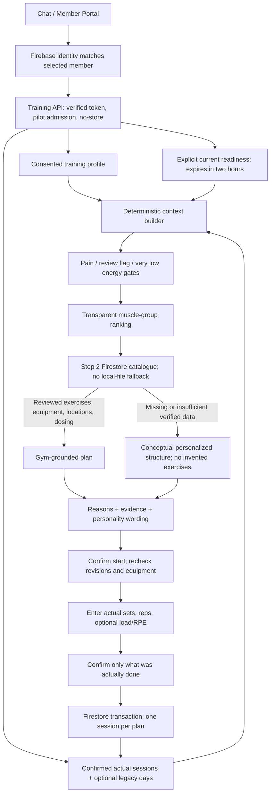

# Step 3: Member memory and adaptive training

## Scope and baseline

Implemented against main commit `d40f9d37dff128ab2fdf079276dbaac70c37e0d7` (the AI Studio Gym Knowledge implementation). The older `feat/shine-ai-companion` branch was not merged. Runtime AI remains optional Gemini intent extraction; using GPT to develop this change does not switch the application's model provider.

This is a controlled adult pilot, not a clinically validated trainer or a production security certification. No real equipment, business photographs, member histories or reviewed exercise prescriptions are seeded. There is no food, vision, Places, wearable or automatic load-progression implementation in this step.

## System diagram

## Data ownership and storage

`training_members/{firebaseUid}` is the authoritative private root. It contains profile, profileRevision, historyRevision, state and the latest readiness. Subcollections are `plans`, `sessions`, and `measurements`. A separate root avoids trusting the legacy `members` API's broad client-editable fields; contact and commercial membership records are not duplicated.

`training_access/{uid}` is a server-managed pilot entitlement. Admission requires an explicit UID in `SHINE_TRAINING_PILOT_UIDS`, or `enabled: true` in this collection with optional valid future ISO `expiresAt`. A client-editable VIP tier or paid status is never admission evidence. Firebase authentication is not proof of a paid gym contract.

The backend checks Firebase tokens with revocation/disabled-user checking. Verified email is required. Request bodies cannot choose ownership. New Firestore collections are server-only; the client uses authenticated HTTP APIs. No private cache is shared between members. Switching Firebase users unmounts the workspace and rejects in-flight API results belonging to the previous account.

The new profile is a structured memory, not a trained model. Changes to weight create dated self-reported measurement points. Profiles require explicit adult confirmation, consent and health-review screening. Height/weight never determine a diagnosis, load, injury risk or calorie deficit.

## Legacy data interoperability

The context builder reads confirmed Step 3 sessions over a bounded 90-day window (at most 500 detailed records), computes 7/14-day summaries and displays recent sessions. It optionally reads legacy `workout_logs` by exact `uid`/`userId`, with user opt-in. Legacy exercise entries with completed sets are aggregated as *self-reported training days*, not fabricated sessions. The same day/group is not counted again when a canonical session already exists. Existing proposed plans and sample rows are excluded.

Progress records are joined only by exact ownership, never by email, phone or membershipCode. Anonymous health assessments are not automatically attached to a member. Optional legacy source/index failures produce explicit warnings and limited-context flags; they are not represented as proof of no activity. New canonical storage failures fail closed.

No dual-write is made to the old workout collections: this prevents double-counting. The new Training tab inside Member Portal reads the authoritative new history. Existing legacy charts remain legacy-only. Full chart consolidation is a later migration, not a hidden claim of this implementation.

Legacy rules now prevent new conflicting owner fields or ownership transfers. Existing legacy read-query behavior is retained for compatibility; old inconsistent rows require a separate audit/migration and are discarded by the new server context builder. The legacy `/api/members/lookup` is restricted to the token's own UID.

## Readiness and planning

Readiness includes available minutes (10-120), energy (1-5), current pain, soreness groups, requested groups, blocked equipment IDs, notes and explicit confirmation. No default silently means 'no pain'. Client edits clear confirmation. Server timestamps/readiness ID/profile revision are authoritative. Readiness expires in two hours and is invalidated by profile or completed-history changes.

Current pain or a health-review flag pauses automatic planning. Energy 1 returns a review/rest state. Energy 2 reduces volume and uses a shorter estimated time budget. These are conservative product heuristics, not clinical screening or a recovery assessment.

Muscle ranking: explicit request +100; stated preference +8; recent recorded training within two local calendar days -25; relative underrepresentation in non-truncated recorded history up to +20; self-reported soreness excludes the group. Recent training is a ranking signal, not a mandatory 48-hour recovery rule. No absent-history claim is made when retrieval is truncated. Secondary muscle mappings are included in soreness filtering; unknown mappings prevent automatic use.

### Gym-grounded mode

The planner reads the actual Step 2 `gym_zones`, `gym_equipment` and `gym_exercises` collections. It does not trust the local catalogue fallback or synthetic templates. Every required equipment ID must be satisfied; the array is not treated as interchangeable alternatives.

Eligibility includes human-reviewed exercise and equipment, valid reviewed zone, operational and functional equipment, actual directions, appropriate difficulty, mapped muscles, trainer cues and a goal-compatible `trainingPrescription`. The latter is deliberately new: Step 2 had no reviewed sets/reps/rest. The administration screen allows a human reviewer to enter those values rather than allowing AI to fabricate them.

Prescriptions record reviewer UID, timestamp and the exact exercise revision. Any later edit to the exercise invalidates the prescription until reviewed again. Missing prescription/goal mapping causes exclusion. Sample data cannot be promoted using the existing verify route.

The time model sums reviewed sets x maximum reps x estimated seconds per rep, inter-set rest, setup, conservative transition allowances, warm-up and cooldown. It reduces set count to fit the budget; it does not add unverified filler. Transition allowances are estimates, not an indoor navigation measurement. Previous load is displayed unchanged as reference, not increased automatically. In the pilot, mobility/endurance goals use conceptual structure rather than automatically repurposing strength prescriptions.

### Personalized-general mode

When no eligible gym catalogue exists, the assistant still uses the member's real profile/readiness/history to suggest target groups, conceptual movement patterns, a time allocation and explanation. `kind: structure_only` is explicit. `exercises` is empty: there are no machine names, locations, invented trainer cues or AI-written sets/reps. These blocks are for planning/discussion, not a claimed executable trainer-approved programme.

The member can subsequently log activities actually performed, with self-entered names and groups. They must not supply a verified exercise ID for these general self-reports. This keeps personal memory functional while company data is unavailable, without laundering generic knowledge into gym facts.

If the caller explicitly requests gym-only planning, insufficient verified data produces `insufficient_verified_gym_data`, not a hidden generic fallback.

## Action state and concurrency

Plans preserve profile/history/catalogue revisions, readiness ID, source evidence and generated/expiry times. A proposed plan is not history. Starting requires explicit confirmation and rechecks context and selected catalogue records. Started sessions can be logged later; current catalogue changes are not used to deny recording what already happened.

Actual sets start blank. Unknown load is `null`; zero explicitly means no external load. Skipped exercises do not count. Partial gym plans store partial sessions. Completion does not infer missing exercises or sets. Each plan has one session document; concurrent identical retries return the existing record, while conflicting facts return HTTP 409. A lost success response retains the same request payload for retry. A failed UI refresh after a successful write does not report that the write failed.

Profile/history revision changes are checked in the transaction. Old plans retain their original context; the member must acknowledge a changed profile when recording past performance. History updates invalidate readiness. Deleting a session leaves a minimal tombstone so late retries cannot resurrect it.

Account-data deletion uses a deletion token/state to block writes and concurrent deletion races. It removes Step 3 plans, sessions and measurements, not legacy commercial/portal data. A minimal root revision/deletion tombstone remains for replay protection. Export is limited to 1,000 records per type and reports a limit explicitly rather than silently truncating.

## Intent understanding and personality

Core requests in Vietnamese/English use a bounded rule parser. Optional Gemini structured extraction applies to unrecognized requests only when both key and `SHINE_TRAINING_INTENT_MODEL` are configured. It receives the current message only, not member measurements, emails or full history. Output is revalidated. Model failure returns a transparent rules fallback; no model name is invented.

Chat can prefill duration/groups; it cannot confirm readiness or silently write a workout. Casual 'I trained chest yesterday' stays conversational until an explicit actual log is recorded. The assistant is intentionally not an unrestricted agent.

Gentle, energetic and direct styles change wording only. Explanation panels use actual scoring factors, catalogue revisions and context-completeness flags. Completeness describes available data, not a calibrated probability or medical confidence score.

## Code map

- `shared/training.ts`: shared typed contracts.
- `server/src/companion/training/{validation,context,planner}.ts`: pure domain logic.
- `store.ts`: Firestore adapter and test seam.
- `service.ts`: UID-scoped reads, revisions, transactions and privacy lifecycle.
- `intent.ts`: bounded rules / optional Gemini structured extraction.
- `router.ts`: authenticated API, pilot admission, rate limits and prescription review.
- `src/components/training/`: actual React workspace, forms, review editor, transport, translations and scoped styles.
- `tests/training/`: domain, service, HTTP, real Firebase emulator and isolated browser harness.

## Limits before production

Read-only CI is not a production audit. Distributed rate limiting, production index deployment, real provider smoke tests, data-retention policy, privacy notice and expert exercise review remain rollout responsibilities. Admin email membership does not independently certify professional qualifications. No real gym inventory is seeded. No guarantee is made about muscle recovery, exercise outcomes or exact timing.

References: [Firebase token verification](https://firebase.google.com/docs/auth/admin/verify-id-tokens), [Firestore transactions](https://firebase.google.com/docs/firestore/manage-data/transactions), [Auth Emulator](https://firebase.google.com/docs/emulator-suite/connect_auth), [Gemini structured output](https://ai.google.dev/gemini-api/docs/structured-output).
