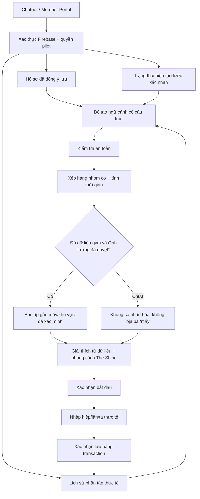

# Step 3 — Kiến trúc Member Memory và Adaptive Workout

Đọc kèm [kiến trúc kỹ thuật](step3-architecture.md), [hướng dẫn chạy pilot](step3-pilot-guide.vi.md) và [báo cáo kiểm chứng](step3-verification.md).

## 1. Phạm vi thực tế

Bản này được xây từ main `d40f9d37dff128ab2fdf079276dbaac70c37e0d7`, giữ phần Gym Knowledge đã nhập từ AI Studio. Không gộp nhánh Companion cũ, không thay ứng dụng bằng demo khác và chưa triển khai production.

Mục tiêu: trợ lý dùng đúng hồ sơ, trạng thái hiện tại và phần tập đã ghi nhận của hội viên để hỗ trợ chọn buổi tập. Khi đủ dữ liệu gym đã duyệt, kết quả gắn với bài và máy thực tế. Khi thiếu dữ liệu, kết quả là khung vận động/thời gian có giải thích, không phải giáo án định lượng được tự sáng tác.

Không đưa dữ liệu máy, ảnh, hội viên hoặc nội dung HLV giả vào môi trường thật. Nhận diện ảnh, dinh dưỡng, Places, thiết bị đeo, tự tăng tạ và giáo án nhiều tuần nằm ngoài Step 3.

## 2. Luồng tổng thể



## 3. Kỹ thuật được sử dụng

| Kỹ thuật | Công việc thực tế |
| --- | --- |
| Structured personal memory | Lưu hồ sơ, readiness, kế hoạch, buổi thực tế và số đo theo Firebase UID; không huấn luyện lại trọng số mô hình. |
| Context builder | Đọc lịch sử giới hạn, tổng hợp 7/14 ngày, đối chiếu thành tích; không tính kế hoạch dự kiến thành buổi đã hoàn thành. |
| Intent extraction | Bộ nhận diện câu tiếng Việt/Anh; Gemini structured output tùy chọn cho câu chưa nhận diện, sau đó kiểm tra lại dữ liệu. |
| Deterministic ranking | Code xếp hạng theo yêu cầu, sở thích, lịch sử gần đây và ê mỏi; không gọi đây là phép đo phục hồi. |
| Constraint-based planning | Lọc trình độ, nhóm cơ, máy, trạng thái, hướng dẫn và định lượng được duyệt; tính ngân sách thời gian. |
| Evidence-based explanation | Hiển thị các yếu tố thực sự tham gia quyết định, bản ghi và revision; không tạo lời giải thích giả sau khi có kết quả. |
| Human-in-the-loop | Hội viên xác nhận readiness, bắt đầu và phần thực tế; người phụ trách duyệt dữ liệu gym và định lượng. |
| Transaction + idempotency | Một kế hoạch chỉ sinh một nhật ký; gửi lại cùng dữ liệu trả bản đã lưu, dữ liệu mâu thuẫn báo conflict. |
| Personality rendering | Ba phong cách nhẹ nhàng, năng động, trực tiếp đổi cách diễn đạt, không đổi bài, quyền hoặc quy tắc an toàn. |

Runtime không tự chuyển sang OpenAI chỉ vì dùng một trợ lý GPT để viết code. Gemini chỉ là thành phần tùy chọn hiểu yêu cầu; dữ liệu, quyền, phép tính và thao tác ghi do backend kiểm soát.

## 4. Bộ nhớ hội viên

```text
training_members/{firebaseUid}
  profile / profileRevision
  readiness
  historyRevision
  state
  plans/{planId}
  sessions/{planId}
  measurements/{measurementId}

training_access/{firebaseUid}
  enabled
  expiresAt (tùy chọn)
```

Đây là hồ sơ tập riêng, không nhân bản hồ sơ liên hệ/thương mại. Định danh lấy từ token đã kiểm tra, không lấy UID do client tự chọn. Email đã xác minh và quyền pilot là điều kiện truy cập. Quyền pilot không chứng minh hợp đồng gym đã thanh toán.

Đọc dữ liệu legacy cần hội viên đồng ý, khớp UID và trạng thái thực tế. Nhật ký cũ theo bài được tổng hợp thành ngày tập tự báo, không giả định mỗi dòng là một buổi riêng. Không ghép bằng email, số điện thoại hay tên.

Bản mới không ghi kép vào biểu đồ legacy: tab tập luyện mới đọc nhật ký mới; hợp nhất toàn bộ biểu đồ cũ là việc cần làm riêng để tránh đếm trùng.

## 5. Trạng thái hôm nay và quy tắc chọn buổi

Readiness yêu cầu người dùng xác nhận thời gian, năng lượng, đau/ê mỏi, nhóm muốn tập và máy cần tránh. Không mặc định rằng ô chưa trả lời nghĩa là không đau. Readiness có hạn hai giờ; đổi hồ sơ hoặc lịch sử làm dữ liệu cũ cần xác nhận lại.

Đau hiện tại hoặc cờ cần chuyên gia xem xét sẽ dừng lập kế hoạch tự động. Năng lượng rất thấp không bị ghi đè bởi lời động viên. Các ngưỡng này là quy tắc pilot, không phải công cụ chẩn đoán.

Lịch sử gần đây làm giảm ưu tiên một nhóm cơ, không khẳng định cơ cần đúng 48 giờ để hồi phục. Thiếu lịch sử được ghi là thiếu; không coi đó là bằng chứng người dùng không tập. Chiều cao/cân nặng không tự quyết định tạ, nguy cơ chấn thương hoặc mức ăn kiêng.

## 6. Hai chế độ đề xuất

### Gym-grounded

Đọc `gym_zones`, `gym_equipment`, `gym_exercises` của Step 2. Bài, toàn bộ máy bắt buộc, khu vực, chỉ dẫn và định lượng phải đáp ứng điều kiện xác minh. Máy bảo trì, hỏng, không rõ trạng thái hoặc mẫu thử không được dùng.

Step 2 chưa có định lượng được duyệt, nên Step 3 thêm `trainingPrescription` và form duyệt trong Admin Gym Knowledge. Số hiệp/lần/nghỉ không được tự điền bằng AI. Người duyệt và thời điểm do server ghi; thay nội dung bài làm định lượng cũ cần duyệt lại.

Thời gian ước tính bao gồm thực hiện, nghỉ, chuẩn bị và chuyển máy. Mức tạ buổi trước chỉ để tham khảo, không tự tăng. Chỉ dẫn đến máy lấy từ catalogue; chưa có định vị trong nhà.

### Personalized-general

Khi thiếu catalogue đủ điều kiện, trợ lý vẫn dùng hồ sơ/readiness/lịch sử để tạo khung nhóm cơ, kiểu vận động, phân bổ thời gian và lý do. `kind: structure_only`; danh sách bài có định lượng để trống. Không xuất Leg Press, Smith Machine hay khu/tầng giả.

Khung này để lập kế hoạch và trao đổi với HLV, không được gọi là giáo án thực thi đã duyệt. Sau đó hội viên vẫn ghi được hoạt động thực sự đã làm bằng tên/nhóm cơ tự báo, với nguồn dữ liệu tách biệt khỏi bài đã xác minh.

Yêu cầu chỉ dùng gym mà dữ liệu chưa đủ trả `insufficient_verified_gym_data`; không âm thầm đổi sang khung chung.

## 7. Ghi nhận trung thực và bảo vệ dữ liệu

Kế hoạch dự kiến không phải thành tích. Người dùng xác nhận bắt đầu; backend kiểm tra lại catalogue trước khi bắt đầu. Chỉ phần thực tế đã nhập mới được lưu. Buổi thiếu bài/hiệp được ghi partial. Tạ chưa biết là null; 0 là chủ động ghi không có tạ ngoài.

Gửi lại cùng yêu cầu sau mất mạng không sinh bản ghi thứ hai. Nếu server đã lưu nhưng giao diện tải lại thất bại, ứng dụng không báo sai thành chưa lưu. Kế hoạch cũ giữ ngữ cảnh cũ; thay hồ sơ trước khi ghi buổi đã tập cần xác nhận rõ.

Xuất/xóa dữ liệu chỉ áp dụng dữ liệu Step 3 của chính tài khoản. Việc xóa để lại dấu trạng thái tối thiểu chống phục hồi do gửi lại, không xóa hồ sơ thương mại hay nhật ký legacy. Thay tài khoản làm hủy giao diện/ngữ cảnh cũ; dữ liệu riêng không dùng cache chia sẻ.

## 8. Điều kiện nghiệm thu

Kiểm thử nghiệp vụ không thay thế kiểm thử Firebase thật, trình duyệt, staging và nội dung chuyên môn. Báo cáo xác minh phân biệt test với store giả lập, Firebase emulator, UI harness và tài khoản/provider thật.

Trước production cần duyệt dữ liệu máy/bài, xác minh quyền truy cập thực tế, triển khai đúng rules/indexes, thẩm định chính sách lưu/xóa, kiểm tra trên điện thoại thật và xử lý giới hạn vận hành. Build hiện còn cảnh báo bundle frontend lớn; không được gọi là đã tối ưu hiệu năng.

**Cách trình bày:** “Điểm khác biệt không phải AI trả lời dài hơn, mà là trợ lý sử dụng bộ nhớ đúng hội viên, giải thích từ dữ liệu, chọn bài trong những ràng buộc đã kiểm tra và chỉ ghi nhận hành động sau xác nhận.”
