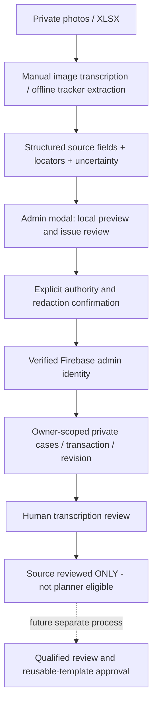

# Training Pathway Intake (pilot)

## Scope

Adds a real admin review modal, typed source model, private API, source-preserving
Master Tracker extractor, review queue, original-versus-edited source retention,
export/deletion and tests. It does NOT train model weights or inject a person's
clinical/exercise record into recommendations. It does NOT claim a single case
establishes a safe or effective fat-loss program.

The repository is public. Only the learning contract, blank templates and code
are checked in. Real, identifier-minimized extracts are delivered separately for
private review. Removing direct identifiers does not make health data non-sensitive.

## Architecture



## Enable on staging

```
SHINE_PATHWAY_INTAKE_ENABLED=true
VITE_SHINE_PATHWAY_INTAKE_ENABLED=true
ADMIN_EMAILS=<existing authorized verified admin emails>
```

Flags default false. Rebuild after changing the client flag. No new provider key
is needed: this version does not call Gemini, OpenAI, OCR, nutrition or Places.
Use Firebase Admin as already configured; ID tokens are verified with revocation
checking. New private Firestore rules must be deployed to staging after review.
Do not use the test-emulator configuration for production.

Open **Admin -> Gym Knowledge -> Training Pathway Intake**.

1. Prepare an identifier-minimized JSON source bundle. Each source stays separate
   until a human resolves subject association. A batch goal is not a per-source goal.
2. Import JSON. Optional image crops remain local browser object URLs; they are
   not sent to a model or persisted. Original XLSX ingestion is the offline Python
   script, not an automatic browser image/Excel recognition feature.
3. Validate preview: no write. Inspect raw fields, source coordinates, repeated
   groups, blank/dash semantics and issue list. Fix uncertain transcription only
   after comparing the source. JSON editing invalidates the old preview.
4. Confirm processing authority and privacy review, then save the private draft.
   API access requires an admin email with verified Firebase identity. Only the
   importing admin's UID namespace is queried. Other admins need a future explicit
   sharing/assignment workflow; being an admin does not expose all source cases.
5. Review transcription only after blockers and source associations are resolved.
   This does NOT approve exercise doses, medical clearance, public publication,
   member history, equipment mapping or reuse for another member.
6. Export sensitive JSON/CSV only to private storage. "Counts only" export contains
   controlled source types/counts, never arbitrary source text, labels or identifiers.
7. Delete when retention is no longer justified. This removes original and edited
   source payloads, retaining only a minimal ID/revision/deletion tombstone to block
   delayed retry resurrection. No automatic legal retention period is asserted.

## Data and API

`shared/pathwayIntake.ts`: executable schema. Header-only CSV and empty JSON are
blank templates, not populated samples and not valid imports until filled.

`pathway_intake_owners/{adminUid}/cases/{caseId}` stores:
- `originalBundle`: first accepted transcription, immutable across edits;
- `bundle`: latest edited source, not silently substituted for the original;
- `revision`, `state`, timestamps and server-stamped reviewer;
- deterministic review result and last-write hash/revision for retry protection.

Case IDs are randomly created on the client, validated on the server, and scoped
to the authenticated admin. They are not member UIDs. No source has permission to
select a member, write training history, change current readiness or publish itself.

Routes under `/api/admin/pathway-intake`:
- `POST /preview`: validate without persistence;
- `GET /cases`: owner-only bounded queue, explicit truncation flag;
- `GET /cases/:id`: owner-only source export/read;
- `PUT /cases/:id`: explicit private save with expected revision;
- `POST /cases/:id/review`: source-transcription review, never planner approval;
- `DELETE /cases/:id`: revision-checked deletion and retry tombstone.

Both original and current bundles are size-bounded. The response is `no-store`.
No raw sources enter logs, shared chat caches or the public catalogue/RAG. Firestore
client rules deny this collection; authorization is also implemented in the server
because Admin SDK bypasses client rules. No Firestore writes are performed by the
code-generation task or the extraction script.

## Evidence semantics

Never replace missing values with zero or the prior line. Never infer kg/seconds
from column names alone. Preserve the author-written scale for energy and the
original meaning of progress metrics. Keep repeated blocks with their coordinates;
resolve whether they are examples, duplicated formatting or true observations.
Source signatures are not a verified digital approval, consent to reuse, or proof
that every planned set was completed. Dates on two pages do not prove continuity
or the full progression of a multi-week program.

When a health note appears, retain it privately as SOURCE-REPORTED information.
Do not diagnose, clear a training safety flag or create therapeutic nutrition.
Unknown age/goal and inconsistent source identities remain explicit blockers.

## Verification commands

```sh
npm ci --ignore-scripts
node --import tsx --test tests/pathways/domain.test.ts tests/pathways/router.test.ts
npx --no-install tsc -p tsconfig.pathways.json --noEmit
python tests/pathways/tracker_test.py
npm run test:training
npm run lint
npm run build
```

CI additionally runs Firebase Auth/Firestore emulator tests and Chromium modal
flows with synthetic data only. Artifact screenshots are not customer records.
A passing build is not clinical validation or a complete application privacy audit.

## Deferred

Automatic handwriting recognition/provider integration, private source image
retention, collaborative staff assignment, professionally approved reusable
program publishing, automatic member binding, online nutrient analysis and
multi-week adaptive training remain separate work. Current gym-asset intake and
Step 3 planner are preserved; private source cases cannot make either more verified.
