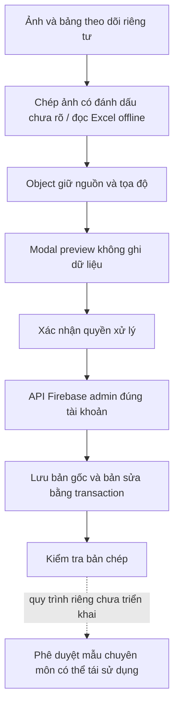

# Tiếp nhận dữ liệu lộ trình tập luyện

## Phần đã triển khai

Nhánh `feat/training-pathway-intake` kế thừa nhánh dữ liệu tài sản và Step 3. Module mới gồm object dữ liệu nguồn, modal quản trị, API riêng tư, kiểm tra dữ liệu, lưu bản gốc/bản sửa, danh sách chờ duyệt, xuất/xóa và công cụ đọc Master Tracker. Chưa merge main hoặc deploy.

Đây là bước chuẩn hóa tri thức đầu vào, không huấn luyện lại trọng số mô hình. Hệ thống chưa tự dùng hồ sơ của một người làm giáo án cho người khác.

## Phân biệt ba loại dữ liệu

1. **Nguồn lịch sử:** phiếu thông tin, trang giáo án và bảng theo dõi. Chỉ thể hiện nội dung đã được ghi trong nguồn; không tự chứng minh mọi buổi đã hoàn thành, tính hiệu quả hoặc tính phù hợp cho người khác.
2. **Bản chép được kiểm tra:** người phụ trách xác nhận đọc đúng chữ, đúng cột, đúng nguồn và đúng người. Đây chưa phải phê duyệt chuyên môn.
3. **Mẫu có thể tái sử dụng:** cần quy trình riêng để người có chuyên môn xác định phạm vi áp dụng, điều kiện không áp dụng, định lượng, liên kết thiết bị và cách điều chỉnh. Chức năng này chưa triển khai trong đợt tiếp nhận hiện tại.

`eligibleForPlanner` của module tiếp nhận luôn là `false`. Không có nút duyệt nào tự biến nguồn lịch sử thành quyền ghi vào nhật ký hội viên, xóa cờ cần chuyên gia kiểm tra hoặc đưa dữ liệu vào RAG công khai.

## AI cần học những gì?

Quy tắc nằm tại `data/training-pathways/learning-contract.json`:

- Mục tiêu được ghi rõ, chỉ số tự khai và các lưu ý được nguồn báo cáo; không coi chúng là chẩn đoán hay xác nhận đủ điều kiện tập.
- Cấu trúc buổi: tên phần được in trên giấy, thứ tự hoạt động, tên bài, Volume/Load/Rest và đơn vị được ghi rõ.
- Theo dõi hằng ngày: ghi chú bữa ăn, giờ ngủ, thói quen và trạng thái tự báo. Một ghi chú kcal không tự trở thành mục tiêu ăn kiêng.
- Theo dõi hằng tuần: tên chỉ số nguyên bản, giao thức đo khi được cung cấp, thang năng lượng và ghi chú kỹ thuật. Không tự đổi thang điểm hoặc định nghĩa chỉ số.
- Theo dõi số đo: giá trị ban đầu và các mốc có dữ liệu; ô trống không được biến thành kết quả theo dõi.

Thiếu thông tin phải giữ thiếu. Dấu gạch ngang không mặc định lặp giá trị trước. Các khối lặp lại phải giữ tọa độ để đối chiếu; không tự đếm thành nhiều buổi hoặc nhiều kết quả độc lập. Chữ chưa đọc rõ được đánh dấu `uncertain`.

## Cấu trúc dữ liệu và nơi lưu

```text
data/training-pathways/
  README.md
  learning-contract.json
  templates/
    source-bundle.template.json
    source-rows.template.csv
  intake-batches/
    intake-001.structure.json

shared/pathwayIntake.ts
server/src/companion/pathways/router.ts
src/components/pathways/PathwayIntakeModal.tsx
scripts/extract-pathway-tracker.py
```

Trong Git chỉ có code, mẫu trống, quy tắc và bảng số lượng cấu trúc. Manifest của đợt đầu ghi nhận 3 nguồn, 90 dòng trích xuất, 9 trường chưa đọc chắc chắn và 3 nhóm khối lặp. Nó không chứa tên, số đo, bệnh lý, bài viết tay, ngày tập hay nội dung khách hàng.

Bộ trích xuất thực tế được bàn giao riêng dưới `training-pathways-private/intake-001/`. Bỏ tên/số điện thoại chưa làm dữ liệu sức khỏe trở thành dữ liệu vô danh. Không commit bộ này; nên lưu ngoài Git checkout và ngoài thư mục website phục vụ ra trình duyệt. `.gitignore` là lớp tránh commit nhầm, không phải cơ chế phân quyền lưu trữ.

API lưu bản người dùng xác nhận tại:

```text
pathway_intake_owners/{FirebaseAdminUid}/cases/{caseId}
```

Admin phải đăng nhập Firebase, email đã xác minh và có trong `ADMIN_EMAILS`. Mỗi admin chỉ đọc/sửa/xóa namespace của mình; chưa có chức năng chia sẻ case giữa nhân viên. Định danh không lấy từ nội dung file.

## Sử dụng modal

Bật trên staging sau khi kiểm tra cấu hình Firebase và rules:

```dotenv
SHINE_PATHWAY_INTAKE_ENABLED=true
VITE_SHINE_PATHWAY_INTAKE_ENABLED=true
```

Hai cờ mặc định `false`. Build lại frontend sau khi đổi cờ Vite. Module này không cần API key AI mới.

Mở **Admin → Gym Knowledge → Training Pathway Intake**.

1. Nhập JSON nguồn đã loại định danh trực tiếp; chọn Validate preview. Preview không ghi database.
2. Đọc nội dung, vị trí ô/trang, phần in trên giấy, trường không rõ và các nhóm bị lặp.
3. Có thể chọn ảnh đã che định danh để đối chiếu. Ảnh chỉ ở tab trình duyệt bằng object URL, không được gửi đến AI hoặc lưu vào case. Đóng modal sẽ giải phóng ảnh.
4. Sửa JSON hoặc bổ sung bằng chứng giải quyết vấn đề; sửa JSON sẽ hủy hiệu lực preview cũ.
5. Xác nhận quyền xử lý và kiểm tra riêng tư trước khi Save private draft.
6. Khi đã giải quyết các vấn đề đọc/ghép nguồn, có thể Mark transcription reviewed. Đây chỉ là kiểm tra bản chép, không phải cấp phép tư vấn tập luyện.
7. Có thể xuất JSON/CSV riêng tư, xuất số lượng không kèm nội dung, hoặc xóa case. Xóa loại cả bản gốc và bản sửa, chỉ giữ dấu revision tối thiểu để ngăn request cũ tạo lại dữ liệu.

Công cụ Excel hiện chạy offline bằng Python/openpyxl cho layout Master Tracker được hỗ trợ. Bản này không tự nhận diện chữ viết tay và chưa nhận trực tiếp XLSX trong trình duyệt.

## Kỹ thuật



Các kỹ thuật chính là structured extraction, source provenance, validation, human review, dữ liệu tối thiểu cần thiết, quyền theo chủ sở hữu, optimistic concurrency và idempotency. Không có fine-tuning, tự ghép hội viên, nhận diện người từ chữ ký hay công bố nguồn riêng tư.

## Giới hạn và bước kế tiếp

Chưa có bộ chọn lộ trình từ các case, chưa có tái sử dụng giáo án nhiều tuần và chưa có kiểm định chuyên môn. Cần xác nhận nguồn nào thuộc cùng người, ý nghĩa các khối lặp, chữ/đơn vị chưa rõ và quyền sử dụng dữ liệu. Sau đó mới xây một lớp mẫu được người có chuyên môn duyệt, tách khỏi case riêng tư, để kết nối với bộ nhớ hội viên và catalogue máy đã xác minh.

Không sao chép mức tạ, kcal, trạng thái sức khỏe hoặc chỉ số của case cũ vào hội viên mới. Cũng không sửa các giá trị nguồn bằng kiến thức phổ thông để khiến chúng có vẻ hợp lý.
